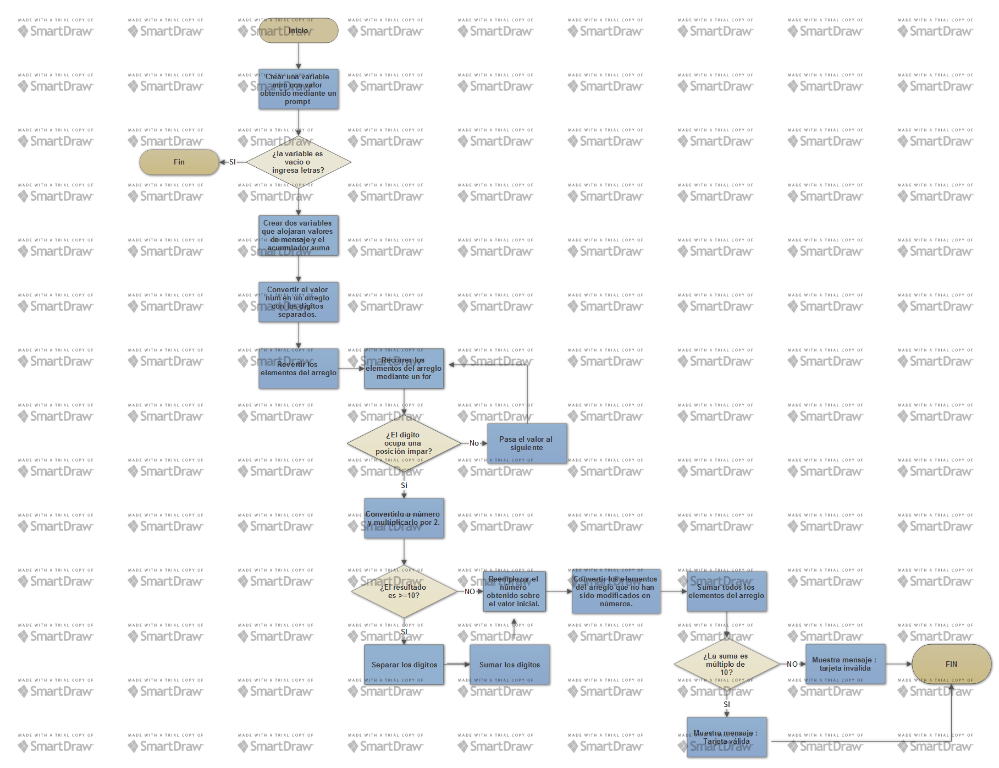

## Validación de Tarjetas
La siguiente web ha sido diseñada para validar el número de una tarjeta de crédito o débito, según el algoritmo de Luhn.
Más información sobre el algoritmo de Luhn en el siguiente link: [Algortimo_Luhn](https://es.wikipedia.org/wiki/Algoritmo_de_Luhn)

Diagrama de flujo :

La web esta conformada por una página principal llamada Index.html, en la cual ejecuta la función llamada **isValidaCard** alojada en el archivo app.js.

La página obtiene la entrada de datos mediante un **prompt** .

### Especificaciones de la función isValidaCard

Para la función **isValidaCard** se implemento lo siguiente :

*  Crear una variable **num** con valor obtenido mediante un prompt ("Ingrese número de tarjeta").
*  Validar si el valor ingresado son solo números y el campo no debe estar vacio.
*  Crear dos variables que alojaran valores de mensaje y el acumulador suma :
var mensaje='';
var suma =0;

*  Convertir el valor **num** en un arreglo con los digitos separados. Esto mediante split('') y asignarle una variable.
*  Revertir el orden de los dígito dentro del arreglo.
var arrayReverse = arrayCard.reverse();
*  Recorrer los dígitos mediante un for, para validar cada dato.
*  Si el dígito ocupa una posición impar :
    * Convertirlo a número y multiplicarlo por 2.
    * Luego validar si este nuevo resultado es >=10
        * Si es asi:
            * separar los digitos
            * Sumar los digitos
            * Reemplazar la suma sobre el valor incialmente elegido.
        * Si No es asi :
            * Reemplazar el número obtenido sobre el valor inicial.
*  Si el dígito no ocupa una posición impar lo salta y pasa al siguiente.
*  Convertir los elementos del arreglo que no han sido modificados en números.  
*  Sumar todos los elementos del arreglo  y alojar el resultado en la variable suma.
*  Validar según la siguiente condición :
    * Si suma%10==0 :
        *  Mostrar mensaje "Tarjeta válida"
    * Sino
        * Mostrar mensaje "Tarjeta Invalida"
* Mostrar el mensaje en la página web
